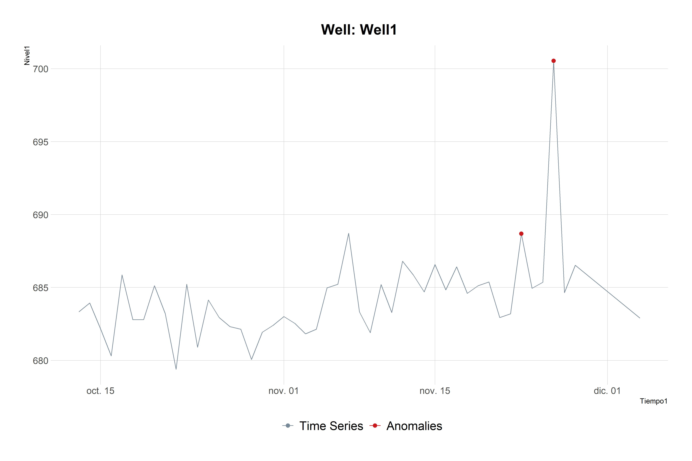

# AnomalyCleaner
This is an R script that cleans anomalies. It is based on Twitter's AnomalyDetection 📦
## Description

A technique for detecting anomalies in seasonal univariate time series.
The methods uses are robust, from a statistical standpoint, in the
presence of seasonality and an underlying trend.\
For more information, you can review the paper [Hochenbaum, J., Vallis, O. S., & Kejariwal, A. (2017). Automatic anomaly detection in the cloud via statistical learning. arXiv preprint arXiv:1704.07706.](https://arxiv.org/abs/1704.07706)\
Another important thing is that I've used a forked version of the original library which is maintained by (@hrbrmstr)
and you can check it [here](https://github.com/hrbrmstr/AnomalyDetection)

## Required libraries
First you have to install the properly `AnomalyDetection` library using this:
```r
install.packages("devtools")
devtools::install_github("hrbrmstr/AnomalyDetection")
```
Then the libraries that are used in this script are:
```r
library(lubridate)
library(AnomalyDetection)
library(hrbrthemes)
library(tidyverse)
library(ggplot2)
```
## Running Example
You can run the script using `RStudio`. This uses the data from `Test_Git.csv` which is
a simple borehole level data set. This type of data usually has many anomalies.\
After it runs, the script will create 2 files:
* **Anom_plots**\
Where you will have all the plots of your data and its anomalies, just like this:



* **Filter_Output**\
Where you will have your dataset cleaned.

## Data's Format
If you want to use your own data you will have to make this kind of `.csv` files:
| Name1 |   Tiempo1  |  Nivel1 |
|:-----:|:----------:|:-------:|
| Well1 | 13/10/1982 | 683.338 |
| Well1 | 14/10/1982 | 683.942 |
| Well1 | 15/10/1982 | 682.167 |
|  ...  |     ...    |   ...   |
| Well7 | 09/12/1983 | 694.684 |
| Well7 | 10/12/1983 | 694.618 |
| Well7 | 11/12/1983 | 694.255 |

Where **Name1** is the ID of the dataset. **Tiempo1** is the date of the data and **Nivel1** 
is the observation.
## Important
This is just the first version, I want to add more functionalities like smoothing the output data.
## Contact
If you want to improve the code, please feel free to contact me or just make a pull request.\
email: `sebastian.vazquez@ug.uchile.cl`\
[Linkedin](https://www.linkedin.com/in/sebasti%C3%A1n-v%C3%A1zquez-gasty-952121181/)
